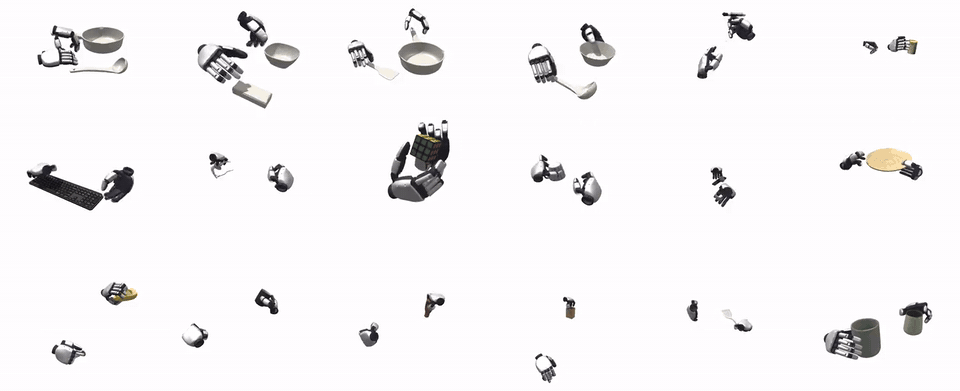

# FlashDexRetarget

Official implementation of

**FlashDexRetarget: Accelerating Dexterous Manipulation Data Generation through Multi-Motion Retargeting**

[](https://arxiv.org/abs/2610.01849)
[](https://holiday-robot.github.io/FlashDexRetarget/)

> [Kyungmin Lee](https://kyungminn.github.io/)\*<sup>1</sup>, [Sibeen Kim](https://sibisibi.github.io/)\*<sup>1</sup>, [Dongyoon Hwang](https://godnpeter.github.io/)\*<sup>1</sup>, [Yoonsang Oh](https://yoonsangoh.github.io/)\*<sup>1</sup>, [Donghu Kim](https://i-am-proto.github.io/)<sup>2</sup>, [Youngdo Lee](https://leeyngdo.github.io/)<sup>2</sup>, [I Made Aswin Nahrendra](https://anahrendra.github.io/)<sup>2</sup>, [Jaegul Choo](https://sites.google.com/site/jaegulchoo/)<sup>1&dagger;</sup>, [Hojoon Lee](https://joonleesky.github.io/)<sup>2&dagger;</sup>
>
> **<sup>1</sup>KAIST AI, <sup>2</sup>Holiday Robotics**
>
> arXiv'2026. (\* indicates equal contribution, <sup>&dagger;</sup> indicates corresponding author)

**FlashDexRetarget** retargets large collections of human hand-object demonstrations to a dexterous robot hand
by training **one RL policy jointly across all reference motions**, instead of optimizing every demonstration separately.
<p align="center">
  
</p>

## Quickstart

```sh
# 1. environment (conda env, Isaac Sim 5.1 / Isaac Lab 2.3, robot USDs)
bash scripts/setup.sh
# 2. data: MANO models in assets/mano/ (see Data), then a released dataset
#    -> <output_dataset_path>/<robot>/motion.pt (taco.sh | oakink2.sh | hot3d_1obj.sh)
bash scripts/retarget/taco.sh <raw_dataset_path> <output_dataset_path>
# 3. train (~110 GB of GPU memory; with runner.agent.buffer_device_type=cpu ~16 GB GPU + ~100 GB RAM)
MOTION=<output_dataset_path>/xhand/motion.pt bash scripts/train_flashdexretarget.sh
```

## Documentation

- [`docs/guide/flashdexretarget.md`](docs/guide/flashdexretarget.md): training options (launcher variables,
  Hydra overrides), GPU memory, stop / resume, evaluation, outputs.
- [`docs/guide/kinematic_retargeting.md`](docs/guide/kinematic_retargeting.md): data, from a released dataset to
  `motion.pt`: dataset layout, clip format, every pipeline step and its settings, `motion.pt` contents.

## Setup

```sh
git clone --recursive https://github.com/Holiday-Robot/FlashDexRetarget.git
cd FlashDexRetarget
bash scripts/setup.sh
```

One script builds the conda env `FlashDexRetarget` (pinned Isaac freeze, rsl_rl_flashsac), `scripts/env.sh`
and the XHAND and Sharpa Wave USDs.

> [!CAUTION]
> `setup.sh` installs every package with `--no-deps`. Add packages to this env the same way
> (`pip install --no-deps <pkg>`): a plain `pip install` pulls newer torch / warp and breaks Isaac Lab.

<details>
<summary>Troubleshooting</summary>

- Export `OMNI_KIT_ACCEPT_EULA=1` in every shell that imports Isaac Sim (the launchers do); otherwise
  even `import isaacsim` waits for a EULA prompt and dies with `EOF when reading a line`.
- No `libEGL` (headless servers): `export MUJOCO_GL=disabled`.
- A corrupted shader cache after an interrupted first boot: `rm -rf ~/.cache/ov/Kit`.
- `simulation_app.close()` segfaults on isaacsim 5.1, so the runner exits with `os._exit`; a non-zero
  exit code at the very end of a finished run is expected.
- `Unresolved reference prim path ... configuration/*_base.usd` warnings while the scene builds concern
  visual meshes only; physics loads.
- Out of GPU memory: `runner.agent.buffer_device_type=cpu`, or a smaller `runner.agent.buffer_max_length`
  ([GPU memory](docs/guide/flashdexretarget.md#gpu-memory)).

</details>

## Data

Motion data is not part of this repository. A dataset is one directory holding `motion.pt` and the
`objects/` it uses; one script builds it from a released TACO, OakInk2 or HOT3D (segments in which both
hands handle one object).

The import runs the MANO hand model, which is not redistributed here: register at
[mano.is.tue.mpg.de](https://mano.is.tue.mpg.de/), download **Models & Code** (`mano_v1_2.zip`) and put
the two hand models in `assets/mano/` (or symlink an existing copy: `ln -s <dir> assets/mano`):

```sh
mkdir -p assets/mano
unzip mano_v1_2.zip
cp mano_v1_2/models/MANO_{RIGHT,LEFT}.pkl assets/mano/
```

Then:

```sh
ROBOTS="xhand sharpa" bash scripts/retarget/taco.sh <raw_dataset_path> <output_dataset_path>   # oakink2.sh | hot3d_1obj.sh
```

It writes `<output_dataset_path>/<robot>/motion.pt`; every step and its settings are in
[`docs/guide/kinematic_retargeting.md`](docs/guide/kinematic_retargeting.md).

## Training

```sh
MOTION=<output_dataset_path>/xhand/motion.pt bash scripts/train_flashdexretarget.sh
# Hydra overrides go after the script, e.g. a run name and the replay buffer in host RAM
MOTION=<output_dataset_path>/xhand/motion.pt bash scripts/train_flashdexretarget.sh \
    logger.wandb.run_name=my_run runner.agent.buffer_device_type=cpu
```

`ROBOT=sharpa` (with its `sharpa/motion.pt`) trains the Sharpa Wave hand. The defaults live in `config/`
(learner: `config/runner/flashsac.yaml`). The policy is evaluated on every clip each 20M env steps, and
checkpoints and the passing rollouts go to `logs/flashsac/<run>/`. Every option, GPU memory and resuming:
[`docs/guide/flashdexretarget.md`](docs/guide/flashdexretarget.md).

## Visualization

```sh
# a retargeted dataset (<output_dataset_path>/<robot>/motion.pt, or one robot dir) in a viser web viewer
bash scripts/visualization.sh <output_dataset_path>
# plus the archived rollouts of training runs (a run dir, its success/ dir, or logs/flashsac for every run)
bash scripts/visualization.sh <output_dataset_path> logs/flashsac/<run>
```

Open the printed URL (`PORT=8080` by default) in a browser. With a saved run the simulated hands and objects are
drawn solid over the reference (translucent blue); a run trained on another `motion.pt` is tagged `[other reference]`.

## Project Structure

```
src/
  agents/       # FlashSAC agent (per-hand actor-critic, replay buffer, future trajectory encoder)
  runner/       # Off-policy training loop, checkpoints, resume
  envs/         # Observations, actions, rewards, terminations, curriculum, motion command
  evaluation/   # Per-clip evaluation and success archive
  simulator/    # Isaac Sim scene, sensors and asset conversion
  retarget/     # Human demos -> motion.pt (import, IK retargeting, packing)
config/         # Hydra configs (envs, runner, eval, logger, retarget)
scripts/        # Setup, training launcher, viewer, retarget/ (one script per dataset)
assets/         # Robot models (XHAND, Sharpa Wave); MANO models go in assets/mano/
docs/           # Project page and guides (docs/guide/)
train.py        # Training entry point
```

## Citation

```bibtex
@article{lee2026flashdexretarget,
  title   = {FlashDexRetarget: Accelerating Dexterous Manipulation Data Generation through Multi-Motion Retargeting},
  author  = {Lee, Kyungmin and Kim, Sibeen and Hwang, Dongyoon and Oh, Yoonsang and Kim, Donghu and
             Lee, Youngdo and Nahrendra, I Made Aswin and Choo, Jaegul and Lee, Hojoon},
  journal = {arXiv preprint arXiv:2610.01849},
  year    = {2026}
}
```

## License

MIT (see [`LICENSE`](LICENSE)), except for third-party components under their own licenses:
the Sharpa Wave hand model in `assets/robot/sharpa/` (Apache-2.0), the vendored mjlab subset in
`src/simulator/isaacsim/_vendor/mjlab/` (Apache-2.0) and the `third_party/rsl_rl_flashsac` submodule
(BSD-3-Clause). The MANO hand model is not included and is subject to its own license.
